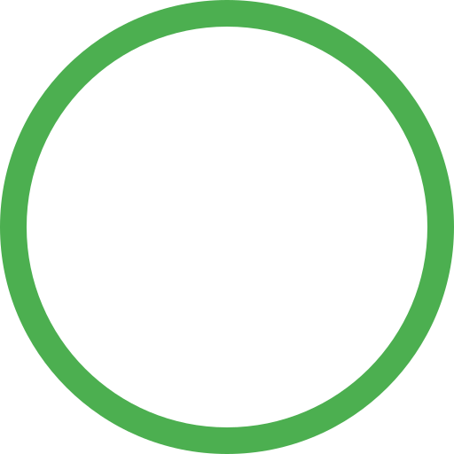

# Project Spark

Project Spark is an innovative platform that allows developers to capture and share ideas for software projects, providing a space for collaboration and project management.



## Table of Contents
- [Project Overview](#project-overview)
- [Features](#features)
- [Getting Started](#getting-started)
- [Usage](#usage)
- [Technologies](#technologies)
- [Contributing](#contributing)
- [License](#license)
- [Contact](#contact)

## Project Overview
Project Spark is a platform designed to facilitate the process of capturing and sharing software project ideas. It allows developers to document their observations of real-world problems and generate ideas to solve them. Additionally, Project Spark serves as a guide for beginners who lack project management skills, providing them with a structured framework to develop and execute their projects.

## Features
- **Idea Documentation:** Developers can easily capture and document their project ideas, including title, description, problem observation, and tags.
- **User Registration and Authentication:** Users can create an account, log in, and authenticate their identity to access the platform's features securely.
- **Collaboration:** Users can collaborate on ideas by leaving comments and providing feedback on each other's projects.
- **Idea Rating System:** Users can upvote or downvote ideas to indicate their interest and help prioritize popular projects.
- **Tagging System:** Ideas can be categorized and tagged with relevant keywords, making them easier to find and filter.
- **Dashboard:** Users have access to a personalized dashboard that provides an overview of their profile, ideas, feedback, and progress.

## Getting Started
To get started with Project Spark, follow these steps:

1. Clone the repository ```git clone 
https://github.com/freedompraise/projectspark.git```
2. Install the necessary dependencies for the frontend using: `npm install`
3. Configure the backend API endpoint in the frontend code.
4. Build and run the frontend application: `npm run dev`

## Usage
Once the project is set up and running, users can perform the following actions:

- Register a new account and log in using their credentials.
- Browse and search for project ideas based on tags, titles, or descriptions.
- View detailed information about specific ideas, including comments and feedback.
- Create new ideas, providing a title, description, problem observation, and relevant tags.
- Leave comments and provide feedback on existing ideas.
- Rate ideas by upvoting or downvoting to express interest and contribute to project prioritization.
- Access their personalized dashboard to view their profile, ideas, feedback, and progress.

## Technologies
Project Spark is built using the following technologies:

- Frontend: React, HTML, CSS
- Backend: Django, Django REST Framework
- Database: PostgreSQL
- Authentication: JWT (JSON Web Tokens)

## Contributing
We welcome contributions from the community to help improve Project Spark. To contribute, please follow the guidelines outlined in the [Contributing](/docs/CONTRIBUTING.md) document.
## License
This project is licensed under the [MIT License](LICENSE).

## Contact
For any questions, feedback, or inquiries, please reach out to the project maintainer at dikepraise119@gmail.com
